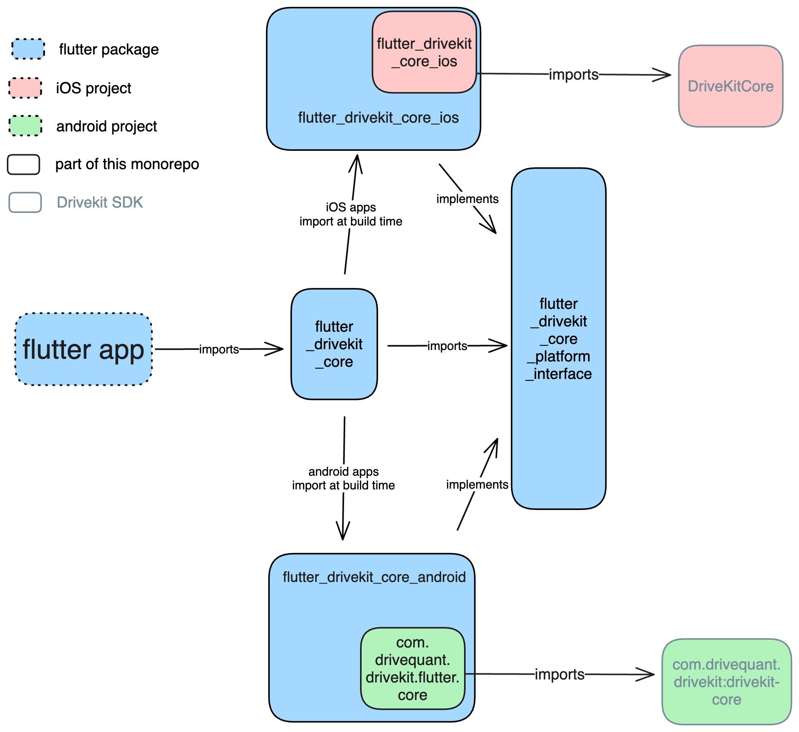

# Flutter Drivekit

Flutter interface for DriveKit SDK

## Installation

This is a Flutter monorepo containing several federated plugins.
To contribute to this project, follow these steps:

1.  Install Flutter by following the official [Flutter installation guide](https://docs.flutter.dev/get-started/install).

2.  Clone the repository using the following command:

    ```shell
    git clone https://github.com/DriveQuantPublic/flutter-drivekit.git
    ```

3.  At the root of the repository, run this command to install the necessary dependencies.

    ```dart
    flutter pub get
    ```

4.  Install Melos by running the following command:

    ```shell
    dart pub global activate melos
    ```

5.  Run this command to install the dependencies for all the federated plugins and example apps:

    ```shell
    melos bootstrap
    ```

    The command `melos bs` is a shorthand for `melos bootstrap`, and can be used instead.

6.  Run this command to install Pigeon, the tool we use to generate the communication code between Flutter and the native code:

    ```shell
    dart pub global activate pigeon
    ```

---

## Architecture:

This monorepo's plugins are federated plugins, which means they are composed of several flutter projects that can be developed and versioned independently.

Here is the architecture of a federated plugin (in this case, the `drivekit_core` plugin, but all plugins follow the same structure):



- `flutter_drivekit_core` is the public package of the plugin, the one users will import in their apps.
- `flutter_drivekit_core_android` is the Android implementation of the plugin. It is responsible for communication with the Android DriveKit SDK.
- `flutter_drivekit_core_ios` is the iOS implementation of the plugin. It is responsible for communication with the iOS DriveKit SDK.
- `flutter_drivekit_core_platform_interface` is the platform interface of the plugin. It defines the API that the Android and iOS implementations must follow, in order to be used by the public package.

The root of the repository contains
configuration files for Melos, which helps manage the dependencies and build process for the federated plugins.

### Communication with native

Inside of a platform implementation package (for example `flutter_drivekit_core_android` or `flutter_drivekit_core_ios`), we use [Pigeon](https://pub.dev/packages/pigeon) to communicate with the native code.

Pigeon is a code generator that generates type-safe communication code between Flutter and the native code. It works by sending messages between Flutter and the native code using platform channels, and it generates the necessary code to serialize and deserialize the messages.

To add a new method to the communication between Flutter and the native code in a platform implementation package, you need to:

- Add the method to the `pigeon/messages.dart` file of the platform implementation package, in the class marked with `@HostApi()`. You can also define all the necessary classes for the method's arguments and return value in this file, and they will be generated by Pigeon on both the Flutter and native sides.
- run this command to generate the necessary code. It will ask you to choose the package you want to generate the code for, or to generate the code for all packages.

  ```shell
  melos pigeon
  ```

  If the command is not recognized, you can try to run

  ```shell
  dart pub global run pigeon
  ```

- Implement the method in the native code in the kotlin or swift plugin file, and call it from the Flutter code of the package.

---

## Run tests

You can run the tests of a package by running the following command anywhere in the repository. It will ask you to choose the package you want to test, or to test all packages:

```shell
melos test
```

You can also ask for a coverage report by running the following command:

```shell
melos test:cov
```

And then open the report with:

```shell
melos open:cov
```

There is also a script to analyze all the monorepo's code with Dart's static analysis tool:

```shell
melos analyze
```

When submitting a pull request, make sure that all tests and the analyzer pass, or the CI will fail.

## Run example app

All the plugins have an example app in the `example` folder of their public package. It's useful to open the native projects with Android Studio and Xcode, and to increase the pub.dev score of the plugin.

Nevertheless, only the DriveKit Core's example is meant to serve as a demonstration of how to use the DriveKit SDK, and demonstrates all plugins working together. Please follow the instructions in [the example's README](packages/drivekit_core/flutter_drivekit_core/example/README.md) to run it.

## Linter

To ensure a consistent code style across the monorepo, avoid code smells and facilitate merge, we use linters.

- KtLint for the android plugins
- SwiftLint for the iOS plugins

### Check on CI

On each pull request

- Dart code style is checked with `melos analyze`
- Android code style is checked with `melos analyze` that runs the ktLint gradle command
- iOS code style is checked with `swiftlint` in its own github action

If the code in your branch is not compliant with the linters, the CI will fail.

### Pre-commit hook to format code

It is recommended to use a pre-commit hook to format the code before committing. To do so, you can use the following command:

```shell
./setup_precommit_hook.sh
```

This script will format the files your are about to commit with the linter.
