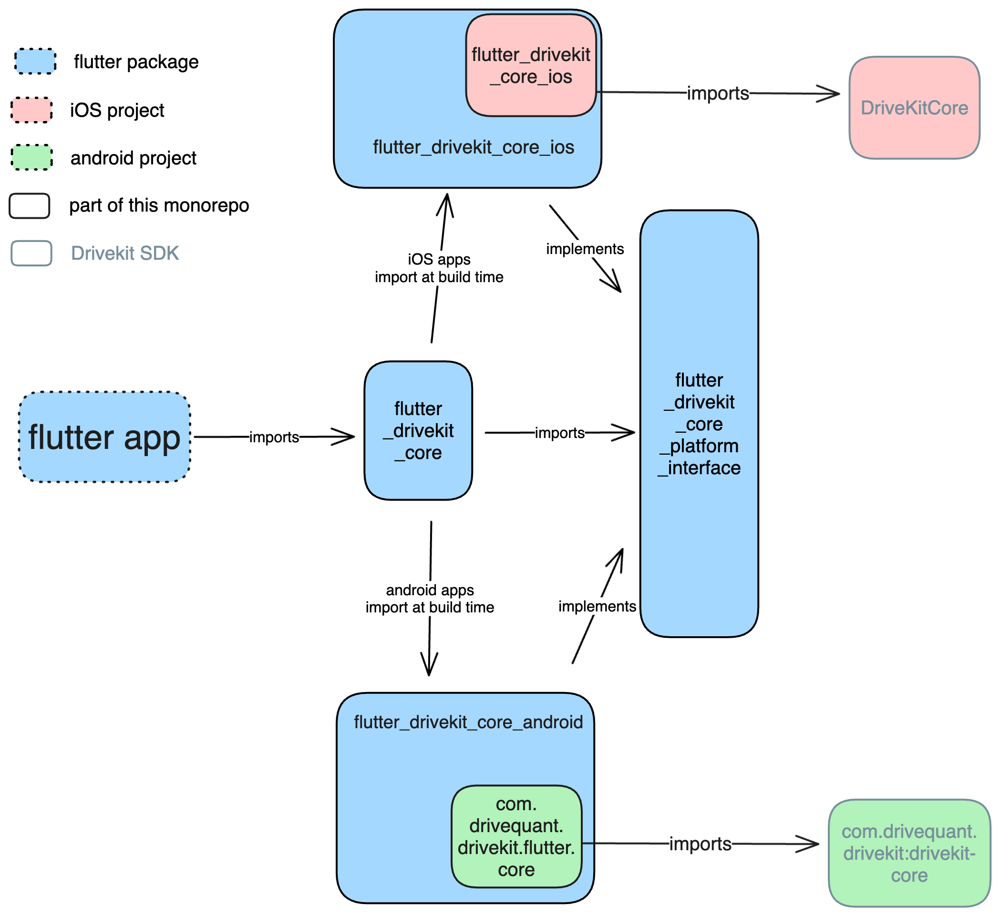

# Flutter Drivekit

Flutter interface for DriveKit SDK

## Installation

This is a Flutter monorepo containing several federated plugins.
To contribute to this project, follow these steps:

1.  Install Flutter by following the official [Flutter installation guide](https://docs.flutter.dev/get-started/install).

2.  Clone the repository using the following command:

    ```shell
    git clone https://github.com/DriveQuantPublic/flutter-drivekit.git
    ```

3.  Run `flutter pub get` at the root of the repository to install the necessary dependencies.

4.  Install Melos by running the following command:

    ```shell
    dart pub global activate melos
    ```

5.  Run `melos bootstrap` to install the dependencies for all the federated plugins and example apps.

---

## Architecture:

This monorepo's plugins are federated plugins, which means they are composed of several flutter projects that can be developed and versioned independently.

Here is the architecture of a federated plugin (in this case, the `drivekit_core` plugin, but all plugins follow the same structure):



- `flutter_drivekit_core` is the public package of the plugin, the one users will import in their apps.
- `flutter_drivekit_core_android` is the Android implementation of the plugin. It is responsible for communication with the Android DriveKit SDK.
- `flutter_drivekit_core_ios` is the iOS implementation of the plugin. It is responsible for communication with the iOS DriveKit SDK.
- `flutter_drivekit_core_platform_interface` is the platform interface of the plugin. It defines the API that the Android and iOS implementations must follow, in order to be used by the public package.

The root of the repository contains
configuration files for Melos, which helps manage the dependencies and build process for the federated plugins.

---

## Run tests

You can run the tests of a package by running the following command anywhere in the repository. It will ask you to choose the package you want to test, or to test all packages:

```shell
melos test
```

You can also ask for a coverage report by running the following command:

```shell
melos test:cov
```

And then open the report with:

```shell
melos open:cov
```

There is also a script to analyze all the monorepo's code with Dart's static analysis tool:

```shell
melos analyze
```

When submitting a pull request, make sure that all tests and the analyzer pass, or the CI will fail.

## Run example app

All the plugins have an example app in the `example` folder of their public package. It's useful to open the native projects with Android Studio and Xcode, and to increase the pub.dev score of the plugin.

Nevertheless, only the DriveKit Core's example is meant to serve as a demonstration of how to use the DriveKit SDK, and demonstrates all plugins working together. Please follow the instructions in [the example's README](packages/drivekit_core/flutter_drivekit_core/example/README.md) to run it.
